<p align="center">
  <a href="README.ru.md"></a>
  <a href="README.md"></a>
</p>

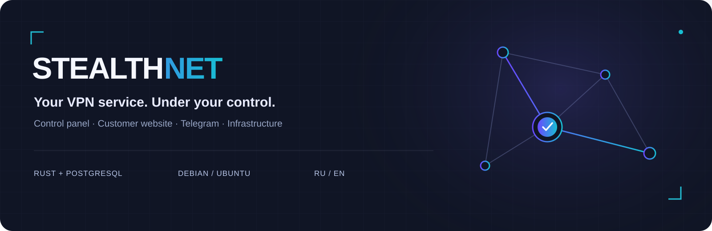

<p align="center">
  <a href="docs/en/installation.md"></a>
  <a href="docs/en/README.md"></a>
  <a href="https://t.me/stealthnet_admin_panel"></a>
  <a href="#support-project"></a>
</p>

**STEALTHNET** brings VPN infrastructure, subscriptions, sales and customer accounts into one platform. Built with Rust and PostgreSQL, with independent services and Russian/English interfaces.

**v0.1.3 · photo attachments in broadcasts.**

<p>
  <a href="https://github.com/STEALTHNET-APP/STEALTHNET-SOFTWARE/releases/tag/v0.1.3">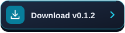</a>
  <a href="docs/compatibility.md"></a>
</p>

## One service, three interfaces

| Owner control panel | Customer website & Mini App | Infrastructure |
|---|---|---|
| Customers, plans, payments, support and alerts | Storefront, code sign-in, purchases, devices and traffic | Profiles, nodes, hosts, squads and subscriptions |
| Versions, diagnostics, installation and branding | RU/EN, light/dark themes, linked Telegram account | Xray agent, access control and bgp.tools information |

## Interface gallery

Click a screenshot to open it at full size.

<table>
<tr>
<td width="50%" valign="top"><h3>Owner control panel</h3><a href="docs/media/panel-nodes-en.png">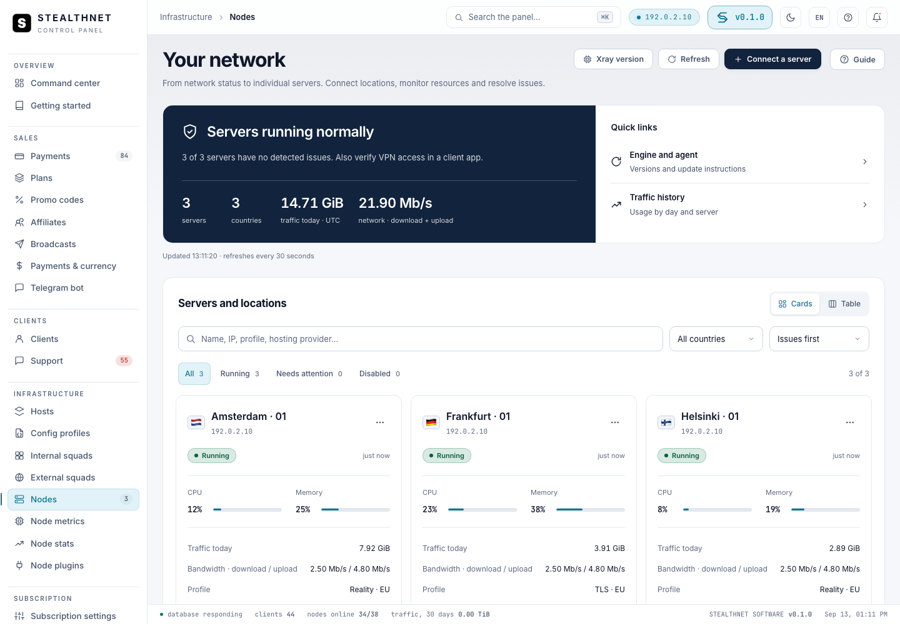</a><p>Nodes, diagnostics and infrastructure</p></td>
<td width="50%" valign="top"><h3>Public website</h3><a href="docs/media/storefront-en.png">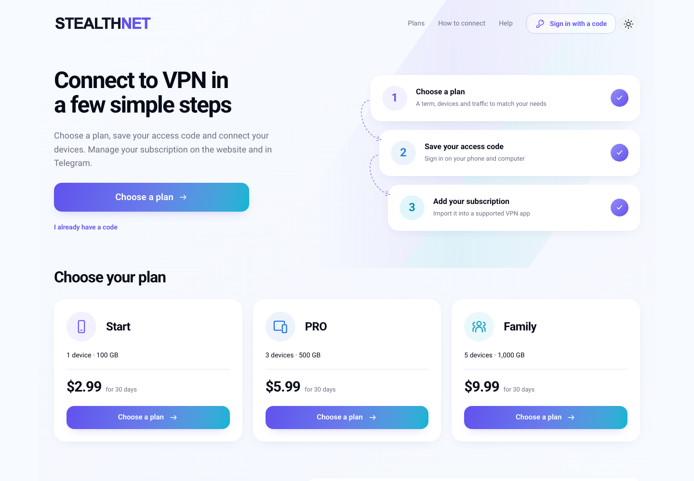</a><p>Service information and plans before sign-in</p></td>
</tr>
<tr>
<td width="50%" valign="top"><h3>Customer account · Desktop</h3><a href="docs/media/cabinet-en.png">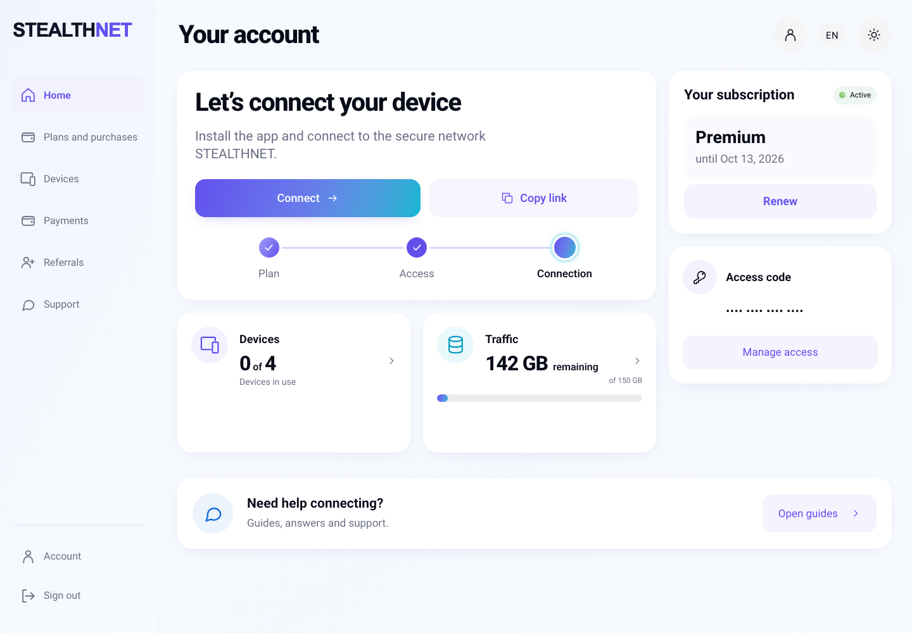</a><p>Subscription, purchases, devices and traffic</p></td>
<td width="50%" valign="top" align="center"><h3>Mini App · Telegram</h3><a href="docs/media/miniapp-en.png">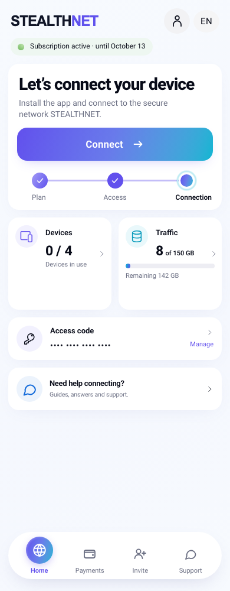</a><p>The same account and subscription inside Telegram</p></td>
</tr>
</table>

Actual interfaces in a test environment with demonstration data.

<p><a href="docs/media/README.md"></a></p>

## Included

- **Sales:** plans/periods, promo codes and referrals; Platega, RollyPay, ParityPay v2, Stars, CryptoBot and manual payments.
- **Add-ons:** packages and prices per plan. Device slots last until the paid term ends; traffic lasts until reset or expiry.
- **Access:** internal squads grant inbounds; an external squad overrides subscription templates and settings.
- **Connection:** subscription page, app instructions and QR; Xray JSON, share-links, Clash/Mihomo/Stash and sing-box output.
- **Customer website:** public storefront, persistent access code, Telegram linking, purchases and support. The website installs separately and hosts Mini App.
- **Branding:** light/dark logos, favicon, colors, SEO, RU/EN content, FAQ and instructions configured in the admin panel.
- **Operations:** release installer, `make update`, pre-update backup, version checks, logs and team alerts.

## Installation

Supported targets: **Debian 12/13**, **Ubuntu 22.04/24.04/26.04 LTS**, **amd64/arm64**. Fresh installation and update were exercised on Debian 13, Ubuntu 24.04 and 26.04 amd64. ARM binaries are built; a separate ARM VM run is still pending.

Requirements, DNS, the setup wizard and HTTPS. Dedicated guides cover nodes, subscriptions and customer websites on shared or separate servers.

<p>
  <a href="docs/en/installation.md"></a>
  <a href="docs/en/node-installation.md"></a>
  <a href="docs/en/subscription-installation.md"></a>
  <a href="docs/en/cabinet-installation.md"></a>
</p>

### Install from GitHub

SSH into a clean Debian/Ubuntu server **as root**, then run:

```bash
apt-get update
apt-get install -y git curl ca-certificates
git clone --branch v0.1.3 --depth 1 https://github.com/STEALTHNET-APP/STEALTHNET-SOFTWARE.git /root/stealthnet-installer
cd /root/stealthnet-installer
bash install.sh --version v0.1.3
```

The wizard asks for panel/subscription domains, service name, currency and owner credentials. It downloads the release for your server architecture, verifies SHA256, and installs PostgreSQL, system services and HTTPS. You do not need to compile Rust.

The repository is cloned into `/root/stealthnet-installer`; the running panel is installed in `/opt/stealthnet-software`. Use `make update` from that installation directory for subsequent panel updates.

On an installed panel:

```bash
cd /opt/stealthnet-software
make update
```

The updater downloads a published release, verifies SHA256 and creates a backup. Returning to previous binaries does not reverse database migrations.
<p>
  <a href="docs/en/backup-restore.md"></a>
</p>

## Task-based documentation

<table>
<tr>
<td width="50%"><a href="docs/en/installation.md">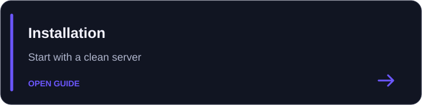</a></td>
<td width="50%"><a href="docs/en/README.md">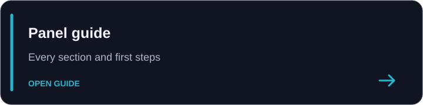</a></td>
</tr>
<tr>
<td width="50%"><a href="docs/en/profiles.md">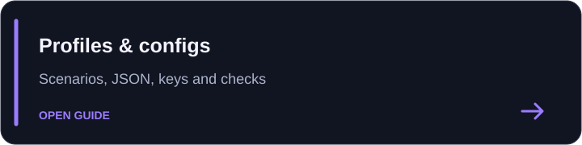</a></td>
<td width="50%"><a href="docs/en/subscription-installation.md">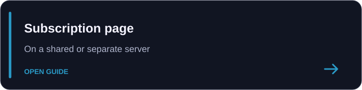</a></td>
</tr>
<tr>
<td width="50%"><a href="docs/en/cabinet-installation.md">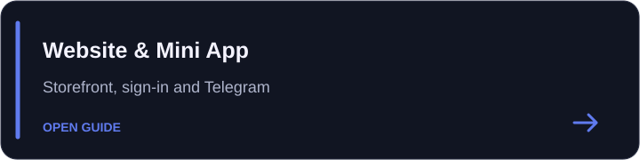</a></td>
<td width="50%"><a href="docs/en/backup-restore.md">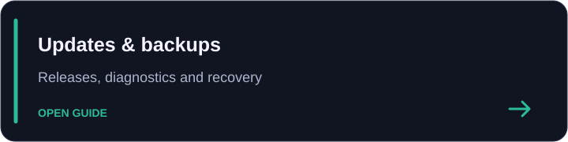</a></td>
</tr>
</table>

<p>
  <a href="docs/en/README.md"></a>
  <a href="docs/en/payment-gateways.md"></a>
  <a href="docs/en/addons.md"></a>
  <a href="docs/en/branding.md"></a>
  <a href="docs/en/team-notifications.md"></a>
  <a href="docs/en/troubleshooting.md"></a>
</p>

## Architecture

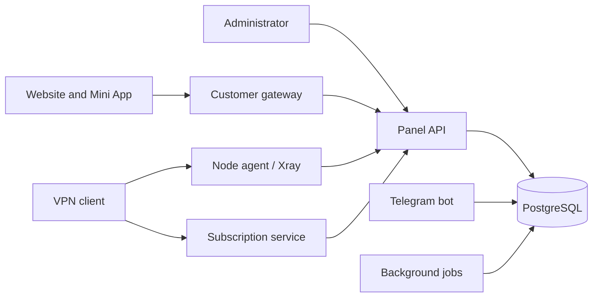

A co-located subscription service can use the local database. Separate customer and subscription gateways in API mode do not need PostgreSQL access.

## Development and license

<p>
<a href="docs/en/development.md">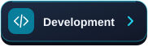</a>
<a href="CONTRIBUTING.md"></a>
<a href="SECURITY.md"></a>
<a href="THIRD_PARTY_NOTICES.md"></a>
</p>

Project license: **AGPL-3.0-only**. Dependencies and fonts retain their own licenses.

<p>
  <a href="LICENSE"></a>
</p>

<a id="support-project"></a>

## Community and project support

<a href="https://t.me/stealthnet_admin_panel"></a>

Optional donations support STEALTHNET development. **Network: TRON · TRC20.**

<p>
  <a href="#donate-address"></a>
</p>

<a id="donate-address"></a>

```text
THQA9Qnx87NcHAwYrcCTBGSi6BhY72LXEZ
```
