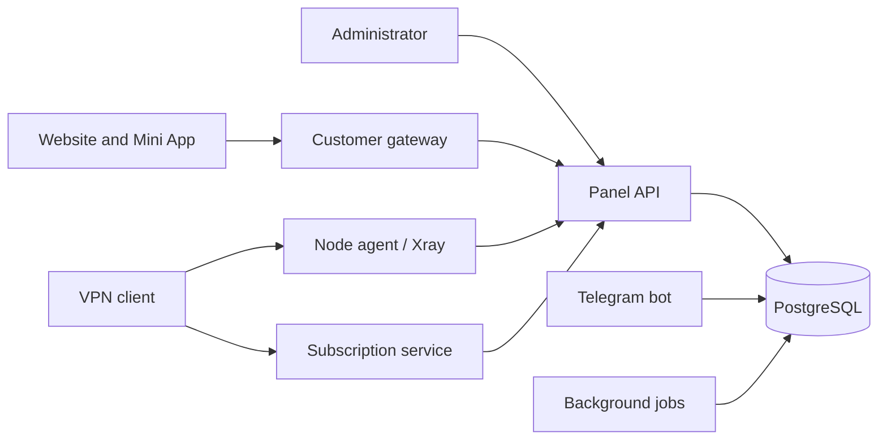

<p align="center"><a href="README.ru.md">Русский</a> · <a href="README.md"><b>English</b></a></p>


<p align="center">
  <a href="docs/en/installation.md"></a>
  <a href="docs/en/README.md"></a>
  <a href="https://t.me/stealthnet_admin_panel"></a>
  <a href="#support-project"></a>
</p>

**STEALTHNET** brings VPN infrastructure, subscriptions, sales and customer accounts into one platform. Built with Rust and PostgreSQL, with independent services and Russian/English interfaces.

**v0.1.0 · first public release.** [Download Linux builds](https://github.com/STEALTHNET-APP/STEALTHNET-SOFTWARE/releases/tag/v0.1.0) · [Compatibility and test scope](docs/compatibility.md).

## One service, three interfaces

| Owner control panel | Customer website & Mini App | Infrastructure |
|---|---|---|
| Customers, plans, payments, support and alerts | Storefront, code sign-in, purchases, devices and traffic | Profiles, nodes, hosts, squads and subscriptions |
| Versions, diagnostics, installation and branding | RU/EN, light/dark themes, linked Telegram account | Xray agent, access control and bgp.tools information |

## Interface gallery

Click a screenshot to open it at full size.

<table>
<tr>
<td width="50%" valign="top"><h3>Owner control panel</h3><a href="docs/media/panel-nodes-en.png"></a><p>Nodes, diagnostics and infrastructure</p></td>
<td width="50%" valign="top"><h3>Public website</h3><a href="docs/media/storefront-en.png"></a><p>Service information and plans before sign-in</p></td>
</tr>
<tr>
<td width="50%" valign="top"><h3>Customer account · Desktop</h3><a href="docs/media/cabinet-en.png"></a><p>Subscription, purchases, devices and traffic</p></td>
<td width="50%" valign="top" align="center"><h3>Mini App · Telegram</h3><a href="docs/media/miniapp-en.png"></a><p>The same account and subscription inside Telegram</p></td>
</tr>
</table>

[About the screenshots](docs/media/README.md): actual interfaces in a test environment with demonstration data.

## Included

- **Sales:** plans/periods, promo codes and referrals; Platega, RollyPay, ParityPay v2, Stars, CryptoBot and manual payments.
- **Add-ons:** packages and prices per plan. Device slots last until the paid term ends; traffic lasts until reset or expiry.
- **Access:** internal squads grant inbounds; an external squad overrides subscription templates and settings.
- **Connection:** subscription page, app instructions and QR; Xray JSON, share-links, Clash/Mihomo/Stash and sing-box output.
- **Customer website:** public storefront, persistent access code, Telegram linking, purchases and support. The website installs separately and hosts Mini App.
- **Branding:** light/dark logos, favicon, colors, SEO, RU/EN content, FAQ and instructions configured in the admin panel.
- **Operations:** release installer, `make update`, pre-update backup, version checks, logs and team alerts.

## Installation

Supported targets: **Debian 12/13**, **Ubuntu 22.04/24.04/26.04 LTS**, **amd64/arm64**. Fresh installation and update were exercised on Debian 13, Ubuntu 24.04 and 26.04 amd64. ARM binaries are built; a separate ARM VM run is still pending.

[Open the installation guide](docs/en/installation.md) for requirements, DNS, wizard, HTTPS and diagnostics. [Nodes](docs/en/node-installation.md), [subscriptions](docs/en/subscription-installation.md) and [customer website](docs/en/cabinet-installation.md) have dedicated instructions, including shared/separate servers.

On an installed panel:

```bash
cd /opt/stealthnet-software
make update
```

The updater downloads a published release, verifies SHA256 and creates a backup. Returning to previous binaries does not reverse database migrations. [Backup and restore](docs/en/backup-restore.md).

## Task-based documentation

<table>
<tr>
<td width="50%"><a href="docs/en/installation.md"></a></td>
<td width="50%"><a href="docs/en/README.md"></a></td>
</tr>
<tr>
<td width="50%"><a href="docs/en/profiles.md"></a></td>
<td width="50%"><a href="docs/en/subscription-installation.md"></a></td>
</tr>
<tr>
<td width="50%"><a href="docs/en/cabinet-installation.md"></a></td>
<td width="50%"><a href="docs/en/backup-restore.md"></a></td>
</tr>
</table>

**[All 34 panel sections](docs/en/README.md)** · [Payments](docs/en/payment-gateways.md) · [Add-ons](docs/en/addons.md) · [Branding & languages](docs/en/branding.md) · [Alerts](docs/en/team-notifications.md) · [Troubleshooting](docs/en/troubleshooting.md)

## Architecture



A co-located subscription service can use the local database. Separate customer and subscription gateways in API mode do not need PostgreSQL access.

## Development and license

[Architecture and development](docs/en/development.md) · [Contributing](CONTRIBUTING.md) · [Security reports](SECURITY.md) · [Third-party notices](THIRD_PARTY_NOTICES.md)

Project license: **AGPL-3.0-only**. Full terms: [LICENSE](LICENSE). Dependencies and fonts retain their own licenses.

<a id="support-project"></a>

## Community and project support

[News, discussions and help · @stealthnet_admin_panel](https://t.me/stealthnet_admin_panel)

Optional donations support STEALTHNET development. **Network: TRON · TRC20.**

```text
THQA9Qnx87NcHAwYrcCTBGSi6BhY72LXEZ
```
