<p align="center">
  <a href="README.ru.md"></a>
  <a href="README.md"></a>
</p>

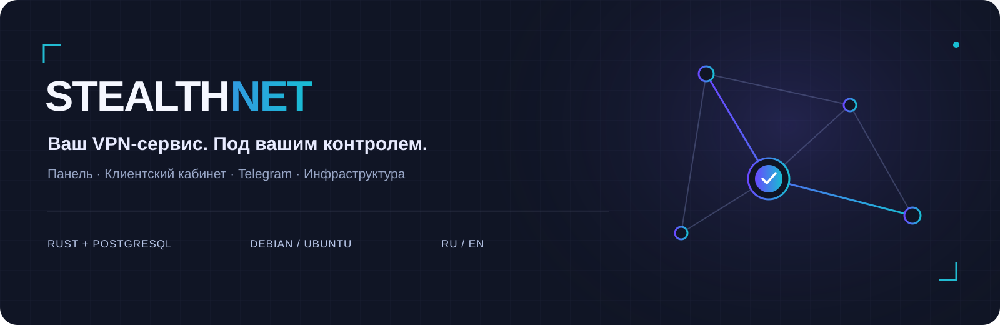

<p align="center">
  <a href="docs/ru/installation.md">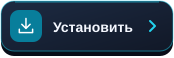</a>
  <a href="docs/ru/README.md"></a>
  <a href="https://t.me/stealthnet_admin_panel"></a>
  <a href="#support-project"></a>
</p>

**STEALTHNET** — платформа для своего VPN-сервиса: инфраструктура, подписки, продажи и клиентские аккаунты в одной системе. Rust и PostgreSQL, независимые службы, интерфейсы на русском и английском.

**v0.1.1 · первое исправление.**

<p>
  <a href="https://github.com/STEALTHNET-APP/STEALTHNET-SOFTWARE/releases/tag/v0.1.1"></a>
  <a href="docs/compatibility.md"></a>
</p>

## Один сервис — три интерфейса

| Панель владельца | Кабинет и Mini App | Инфраструктура |
|---|---|---|
| Клиенты, тарифы, оплаты, поддержка и уведомления | Витрина, вход по коду, покупка, устройства и трафик | Профили, ноды, хосты, сквады и выдача подписок |
| Версии, диагностика, установка и брендинг | RU/EN, светлая/тёмная тема, единый аккаунт с Telegram | Агент Xray, контроль доступа и сведения bgp.tools |

## Галерея интерфейсов

Нажмите на скриншот, чтобы открыть его в полном размере.

<table>
<tr>
<td width="50%" valign="top"><h3>Панель владельца</h3><a href="docs/media/panel-nodes-ru.png">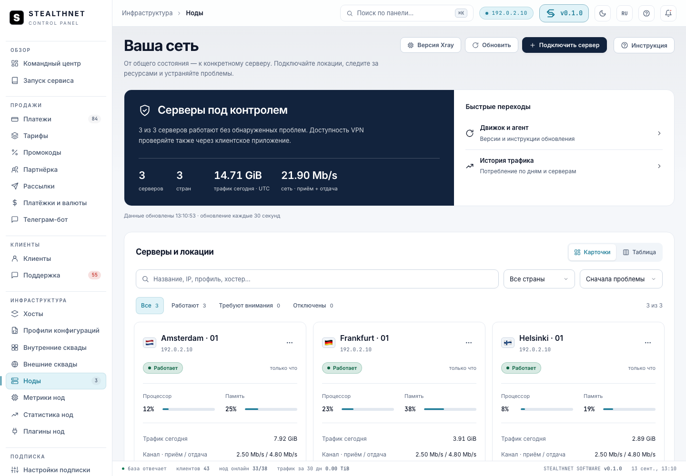</a><p>Ноды, диагностика и инфраструктура</p></td>
<td width="50%" valign="top"><h3>Сайт и витрина</h3><a href="docs/media/storefront-ru.png">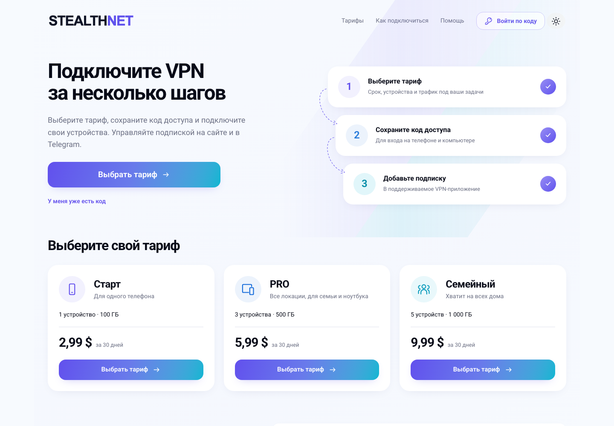</a><p>Описание сервиса и тарифы до входа</p></td>
</tr>
<tr>
<td width="50%" valign="top"><h3>Кабинет клиента · ПК</h3><a href="docs/media/cabinet-ru.png">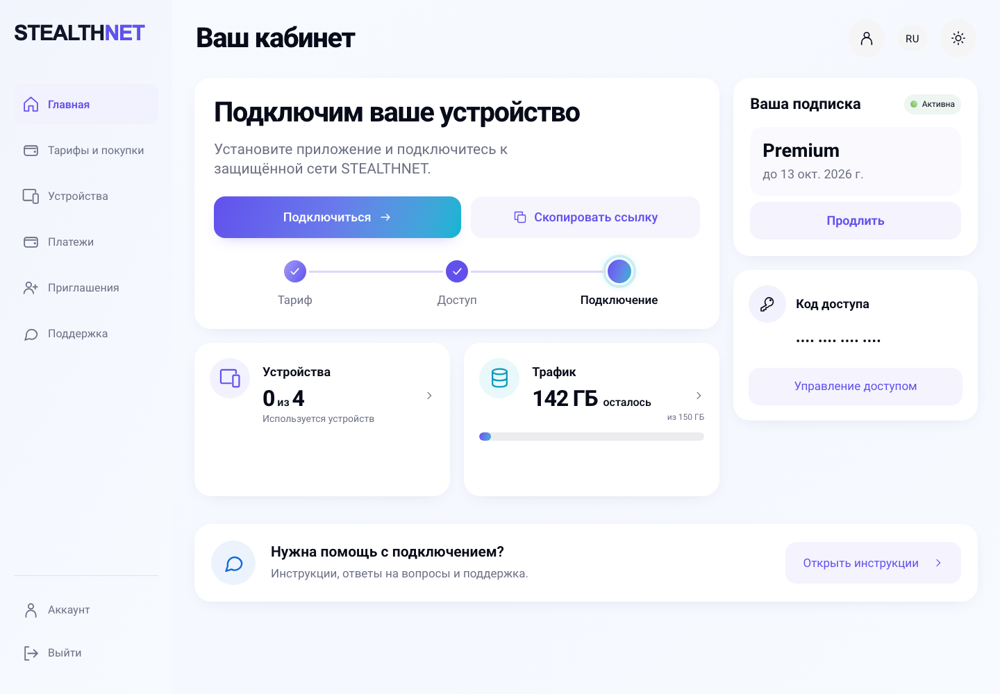</a><p>Подписка, покупки, устройства и трафик</p></td>
<td width="50%" valign="top" align="center"><h3>Mini App · Telegram</h3><a href="docs/media/miniapp-ru.png">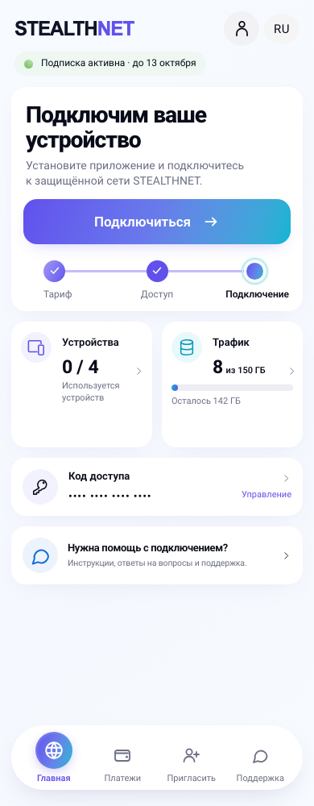</a><p>Тот же аккаунт и подписка внутри Telegram</p></td>
</tr>
</table>

Настоящий интерфейс в тестовом окружении с демонстрационными данными.

<p><a href="docs/media/README.md"></a></p>

## Что включено

- **Продажи:** тарифы и периоды, промокоды, партнёрская программа; Platega, RollyPay, ParityPay v2, Stars, CryptoBot и ручная оплата.
- **Докупки:** отдельные пакеты и цены у каждого тарифа. Устройства — до конца оплаченного срока; трафик — до сброса или окончания подписки.
- **Доступ:** внутренние сквады управляют инбаундами; внешний сквад переопределяет шаблоны и настройки выдачи.
- **Подключение:** страница подписки, приложения, инструкции и QR; выдача Xray JSON, share-links, Clash/Mihomo/Stash и sing-box.
- **Клиентский сайт:** витрина до входа, постоянный код доступа, привязка Telegram, покупки и поддержка. Кабинет устанавливается отдельно; Mini App работает через него.
- **Брендинг:** лого для обеих тем, favicon, цвета, SEO, тексты RU/EN, FAQ и инструкции из админки.
- **Эксплуатация:** установка из релизов, `make update`, резервная копия перед обновлением, проверка версий, журналы и уведомления команды.

## Установка

Поддерживаемые цели: **Debian 12/13**, **Ubuntu 22.04/24.04/26.04 LTS**, **amd64/arm64**. Для новых Debian 13, Ubuntu 24.04 и 26.04 выполнены чистая установка и обновление на amd64; ARM-бинарники собраны, отдельная ARM-VM проверка ещё не выполнена.

Требования, DNS, мастер установки и HTTPS. Для нод, подписки и кабинета есть отдельные инструкции по размещению на одном или разных серверах.

<p>
  <a href="docs/ru/installation.md"></a>
  <a href="docs/ru/node-installation.md"></a>
  <a href="docs/ru/subscription-installation.md"></a>
  <a href="docs/ru/cabinet-installation.md"></a>
</p>

### Установка через GitHub

На чистом Debian/Ubuntu войдите по SSH **как root** и выполните:

```bash
apt-get update
apt-get install -y git curl ca-certificates
git clone --branch v0.1.1 --depth 1 https://github.com/STEALTHNET-APP/STEALTHNET-SOFTWARE.git /root/stealthnet-installer
cd /root/stealthnet-installer
bash install.sh --version v0.1.1
```

Откроется мастер: укажите домены панели и подписки, название сервиса, валюту и данные владельца. Установщик сам скачает готовый релиз для архитектуры сервера, проверит SHA256 и установит PostgreSQL, системные службы и HTTPS. Компилировать Rust не требуется.

Репозиторий загрузится в `/root/stealthnet-installer`, а рабочая панель установится в `/opt/stealthnet-software`. Обновлять установленную панель затем нужно командой `make update` из её рабочего каталога.

На установленной панели:

```bash
cd /opt/stealthnet-software
make update
```

Обновление скачивает опубликованный релиз, проверяет SHA256 и создаёт резервную копию. Возврат бинарников не отменяет миграции базы.
<p>
  <a href="docs/ru/backup-restore.md"></a>
</p>

## Документация по задачам

<table>
<tr>
<td width="50%"><a href="docs/ru/installation.md">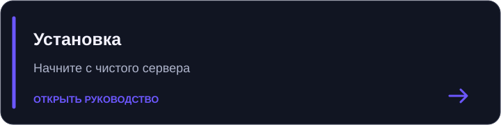</a></td>
<td width="50%"><a href="docs/ru/README.md">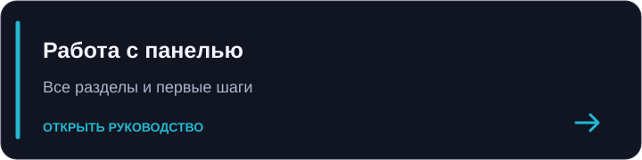</a></td>
</tr>
<tr>
<td width="50%"><a href="docs/ru/profiles.md">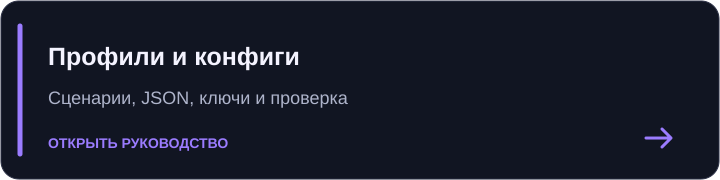</a></td>
<td width="50%"><a href="docs/ru/subscription-installation.md">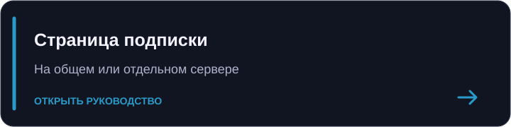</a></td>
</tr>
<tr>
<td width="50%"><a href="docs/ru/cabinet-installation.md">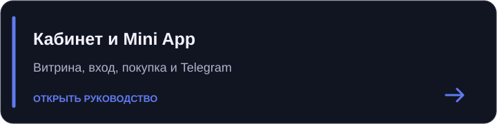</a></td>
<td width="50%"><a href="docs/ru/backup-restore.md">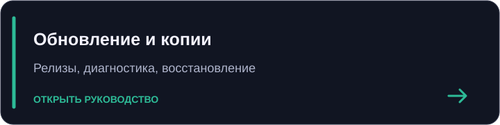</a></td>
</tr>
</table>

<p>
  <a href="docs/ru/README.md"></a>
  <a href="docs/ru/payment-gateways.md"></a>
  <a href="docs/ru/addons.md"></a>
  <a href="docs/ru/branding.md"></a>
  <a href="docs/ru/team-notifications.md"></a>
  <a href="docs/ru/troubleshooting.md"></a>
</p>

## Архитектура

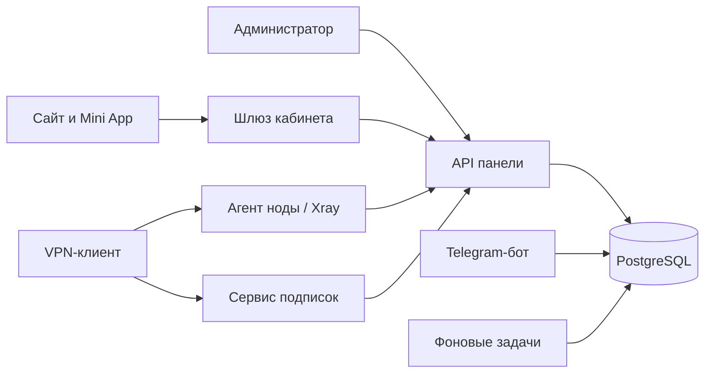

При совместной установке сервис подписок может работать с локальной базой. У отдельного кабинета и сервиса подписок в режиме API нет доступа к PostgreSQL.

## Разработка и лицензия

<p>
<a href="docs/ru/development.md"></a>
<a href="CONTRIBUTING.ru.md"></a>
<a href="SECURITY.md">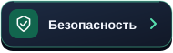</a>
<a href="THIRD_PARTY_NOTICES.md"></a>
</p>

Лицензия проекта: **AGPL-3.0-only**. Лицензии зависимостей и шрифтов сохраняются отдельно.

<p>
  <a href="LICENSE"></a>
</p>

<a id="support-project"></a>

## Сообщество и поддержка проекта

<a href="https://t.me/stealthnet_admin_panel"></a>

Добровольный донат на развитие STEALTHNET. **Сеть: TRON · TRC20.**

<p>
  <a href="#donate-address"></a>
</p>

<a id="donate-address"></a>

```text
THQA9Qnx87NcHAwYrcCTBGSi6BhY72LXEZ
```
